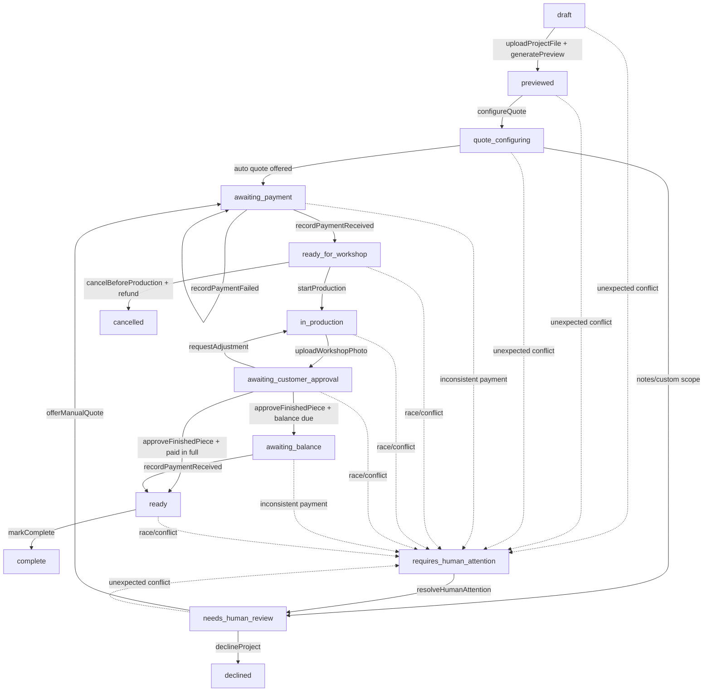

# Shiny Art Shop Project State Machine

The customer-facing container is a **Project** end-to-end.

Internal work may later be split into Jobs, tasks, checklists, or workshop
operations, but the customer sees one Project.

## Core Records

Project:

- `id`
- `ownerUserId`
- `productSurface`
- `title`
- `createdAt`

`ownerUserId` is required. Supabase anonymous identity should exist before login
and be upgraded/linked when the customer signs in with Google.

Project status is derived, not stored.

Related records/facts:

- Project files.
- Preview attempts.
- Quote snapshots.
- Payment records.
- Approval photos.
- Customer approvals.
- Project events.
- Ops events.

Avoid nullable placeholders:

- No quote yet: no QuoteSnapshot.
- No payment yet: no PaymentRecord.
- No approval photo yet: no workshop photo File.
- No approval yet: no ApprovalDecision.

## Derived Statuses

Main statuses:

- `draft`
- `previewed`
- `quote_configuring`
- `needs_human_review`
- `awaiting_payment`
- `ready_for_workshop`
- `in_production`
- `awaiting_customer_approval`
- `awaiting_balance`
- `ready`
- `complete`
- `requires_human_attention`
- `cancelled`
- `declined`

Derived examples:

- No preview: `draft`.
- Preview generated: `previewed`.
- Quote needs human review: `needs_human_review`.
- Quote offered and required payment not received: `awaiting_payment`.
- Required payment received and production not started: `ready_for_workshop`.
- Production started: `in_production`.
- Workshop photo uploaded and not approved: `awaiting_customer_approval`.
- Customer approved and balance remains: `awaiting_balance`.
- Customer approved and required balance paid: `ready`.
- Delivered/collected: `complete`.

`ready_for_workshop` is derived from accepted/offered quote plus required payment
received. No explicit "ready for workshop" event is needed until scheduling
proves it useful.

## Diagram

This is a simple flow diagram, not a full state chart. If side paths grow more
complex, promote it to a state chart.

## Commands

Customer commands:

- `createProject`
- `uploadProjectFile`
- `generatePreview`
- `configureQuote`
- `acceptQuote`
- `cancelBeforeProduction`
- `requestAdjustment`
- `approveFinishedPiece`

Workshop/admin commands:

- `offerManualQuote`
- `declineProject`
- `startProduction`
- `uploadWorkshopPhoto`
- `markReady`
- `markComplete`
- `resolveHumanAttention`

Payment provider commands/webhooks:

- `recordPaymentReceived`
- `recordPaymentFailed`
- `recordRefund`

Commands do not directly set status. Each command:

1. derives current status from facts,
2. validates role and allowed command,
3. appends facts/events/records,
4. returns the new read model.

## Roles

- `customer`: owns Project, uploads files, accepts quote, pays, approves photo,
  cancels before production.
- `builder`: workshop production actions, start production, upload workshop
  photo, mark ready where allowed.
- `admin`: quote/payment/business decisions, manual quote, decline, refund,
  resolve human attention.
- `system`: preview generation, quote calculation, Stripe webhooks, automation.

Builders do not necessarily make pricing/refund decisions. That belongs to
admin.

Unauthorized commands are rejected with auth/permission errors and are not
written into the Project event stream. Security/diagnostic logs may capture
them separately.

## Cancellation And Refunds

Customer self-cancellation is only allowed while status is
`ready_for_workshop`.

Allowed if:

- required payment exists,
- production has not started,
- Project is not blocked/human-attention.

Effects:

- append `project_cancelled_by_customer`,
- request refund via Stripe,
- append refund result when confirmed.

Once `production_started` exists, customer self-cancellation/refund is no longer
available. Human/admin can still refund by exception.

Payment failures are expected:

- append `payment_failed`,
- status remains `awaiting_payment`,
- customer can retry,
- error appears beside payment action.

Unexpected money states create human attention:

- captured payment with no accepted/offered quote,
- duplicate/ambiguous payment,
- partial payment that does not match policy,
- webhook/UI mismatch,
- refund failure.

## Human Attention

`requires_human_attention` is a normal derived status.

It stops automation and customer self-service until a human resolves it.

Customer copy:

> This project needs a quick human check. Don't worry, we're on it and will
> update you shortly.

Project event stream:

- contains valid business facts only,
- may contain `requires_human_attention`,
- does not contain the invalid attempted command as a business event.

Ops event bundle:

- attempted command,
- request id,
- frontend recent actions,
- route/screen,
- selected form state,
- quote input snapshot,
- actor role,
- backend derived status,
- project id,
- error reason,
- app/build versions.

Project ID links ops bundle to full valid Project history.

## Diagnostics

Auto diagnostics are always-on during MVP.

Frontend keeps a rolling action buffer of important actions:

- screen opened,
- upload selected,
- preview requested,
- quote option changed,
- notes added/removed without raw note content unless needed,
- payment clicked,
- approval/cancel clicked,
- API request/result.

Avoid recording:

- raw keystrokes,
- every pointer event,
- duplicated uploaded image bytes.

Customer copy:

> If something goes wrong, we may send a technical report so we can fix it.
